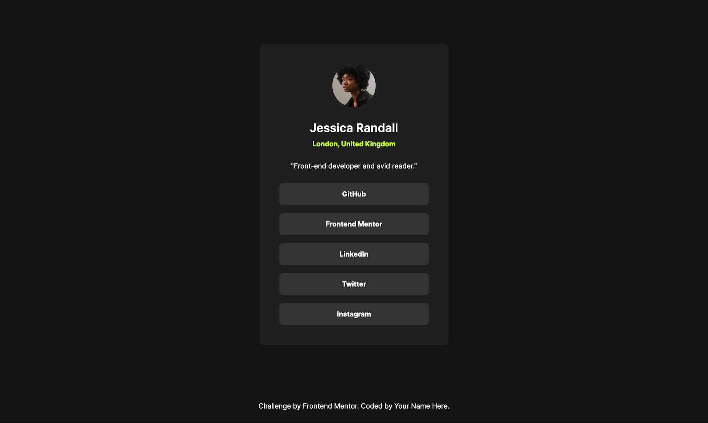

# Frontend Mentor - Social links profile solution

This is a solution to the [Social links profile challenge on Frontend Mentor](https://www.frontendmentor.io/challenges/social-links-profile-UG32l9m6dQ). Frontend Mentor challenges help you improve your coding skills by building realistic projects.

## Table of contents

- [Overview](#overview)
  - [The challenge](#the-challenge)
  - [Screenshot](#screenshot)
  - [Links](#links)
- [My process](#my-process)
  - [Built with](#built-with)
  - [What I learned](#what-i-learned)
  - [Continued development](#continued-development)
  - [Useful resources](#useful-resources)
- [Author](#author)

## Overview

### The challenge

Users should be able to:

- See hover and focus states for all interactive elements on the page

### Screenshot

### Links

- Solution URL: [Add solution URL here](https://your-solution-url.com)
- Live Site URL: [Add live site URL here](https://your-live-site-url.com)

## My process

### Built with

- Semantic HTML5 markup
- CSS custom properties
- SCSS
- Flexbox
- Mobile-first workflow

### What I learned

I started to refactor my code using `@extend`. It helped me spot different repeating parts.

### Continued development

It would be good to use parts for the next projects, seperate the styles into different files; reset, typography, component, ...

### Useful resources

- [A modern css reset](https://www.joshwcomeau.com/css/custom-css-reset/) - A good css reset by Josh Comeau
- [SCSS documentation](https://sass-lang.com/guide/)
- [SCSS setup](https://thinkdobecreate.com/articles/minimum-static-site-sass-setup/) - A Minimum static site setup with sass by Stephanie Eckles

## Author

- Website - [Gwenaël Magnenat](https://gmagnenat.com)
- Frontend Mentor - [@yourusername](https://www.frontendmentor.io/profile/gmagnenat)
- LinkedIn - [@gmagnenat](https://www.linkedin.com/in/yourusername)
